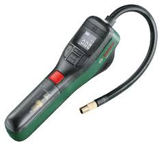

# Bosch Airpump Houder – 3D Print Project

Dit project bevat een op maat gemaakte 3D-geprinte houder voor een digitale Bosch luchtpomp (zoals te zien op de afbeelding).

## 📦 Inhoud

- `Bosch-houder.stl`: 3D-model van de houder
- `CE3V2_Bosch-houder.gcode`: Klaar-voor-gebruik G-code voor een Creality Ender 3 V2
- `airpump.jpg`: Referentieafbeelding van de luchtpomp

## 🖨️ Printinformatie

- **Printer**: Creality Ender 3 V2
- **Filament**: PLA aanbevolen
- **Laaghoogte**: 0.2 mm
- **Infill**: 50%
- **Ondersteuning**: Nee

## 🧠 Doel

Deze houder is ontworpen voor montage in een werkplaats of schuur om de Bosch luchtpomp veilig en snel op te bergen.

---

> Gemaakt door Leon. Voor vragen of suggesties: stuur een Pull Request of open een Issue!
